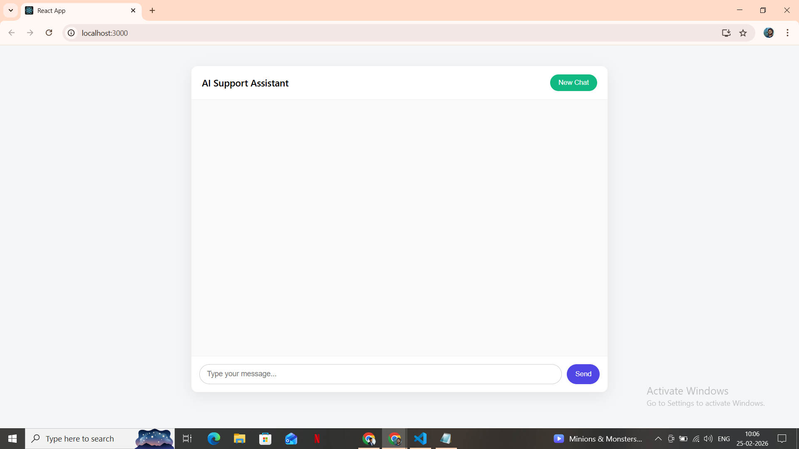

# AI-Powered Support Assistant

This is a full-stack AI-powered support assistant built using React.js, Node.js, Express, SQLite, and Gemini API.

The assistant answers user queries strictly based on the provided product documentation. If the answer is not found in the documentation, it responds with:

"Sorry, I don’t have information about that."

---

## Tech Stack

Frontend:
- React.js
- Axios

Backend:
- Node.js
- Express.js
- SQLite

LLM:
- Gemini 2.5 Flash (Google AI Studio API)

---

## Features

- Chat interface built with React
- Session-based conversation handling
- Messages stored in SQLite database
- Maintains last 5 user-assistant message pairs as context
- Strict document-based answering
- Basic rate limiting
- Error handling for API and database failures
- New Chat option to start fresh session

---

## Project Structure

AI-Powered Support Assistant/

backend/
- server.js
- db.js
- docs.json
- routes/chat.js

frontend/
- src/App.js
- src/App.css

README.md

---

## Setup Instructions

### 1. Clone the repository

git clone <your-repo-link>
cd AI-Powered Support Assistant

---

### 2. Backend Setup

cd backend  
npm install  

Create a .env file inside backend folder:

GEMINI_API_KEY=your_api_key_here

Start backend:

node server.js

Backend runs on:
http://localhost:5000

---

### 3. Frontend Setup

Open a new terminal:

cd frontend  
npm install  
npm start  

Frontend runs on:
http://localhost:3000

---

## How It Works

1. User sends a message from the React UI.
2. Backend stores the message in SQLite.
3. Backend fetches the last 5 message pairs from the database.
4. Documentation, history, and current question are sent to Gemini API.
5. Assistant generates a response based only on documentation.
6. Response is stored in database and displayed in UI.

---

## Documentation Source

The assistant reads from docs.json file:

[
  {
    "title": "Reset Password",
    "content": "Users can reset password from Settings > Security."
  },
  {
    "title": "Refund Policy",
    "content": "Refunds are allowed within 7 days of purchase."
  }
]

---

## Screenshots

Add screenshots in a folder named "screenshots" and reference them like this:

---

## Author

Mani Chandra Dandu  
B.Tech Mechanical Engineering (2024)  
Full Stack Developer (MERN)